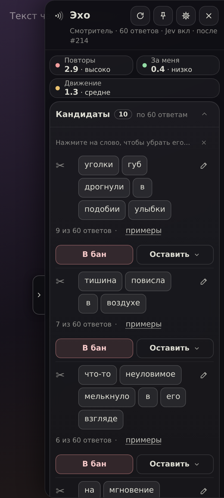
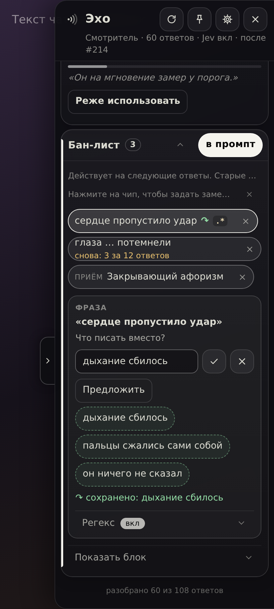
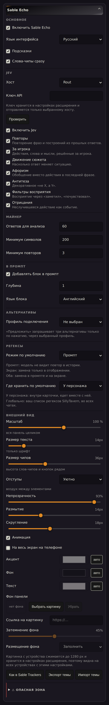

# Sable Echo

Sable Echo is a SillyTavern extension for building a hands-on ban list of repeated phrases, reply openers, and rhetorical patterns; you decide what to ban.
A free local miner finds repeated wording in narrator replies and shows counts and examples, with no key or server plugin.
Optional Jev sensors measure repetition, speaking for the player, and scene movement, and flag rhetorical patterns for review.

  
  
  

Requires SillyTavern 1.18+. No build step or runtime dependencies. The Jeved extension is not required: Echo talks to Jev on its own, and only when you add a key.

**Install**

Copy this repository's URL, open SillyTavern's **Extensions** panel, choose **Install extension**, paste the URL, and install. Reload SillyTavern, then open Sable Echo from its edge tab or floating button. No server configuration changes are needed.

**First use: five steps**

1. Open a single-character chat and the Echo drawer. The interface defaults to Russian; select English in the extension settings if preferred.
2. Review candidate counts and tap the examples line. Rows start collapsed; five appear first, with more available below. If you see “No long responses to analyze yet. Add a phrase manually.”, use the text input.
3. Open the trim link to reveal word chips: “Tap a word to remove it from the phrase.” End cuts shorten the phrase; middle cuts leave a gap (`…`). Add the result to the ban list, or choose “This is intentional” / “Hide for now” in the keep menu. “Added to ban list · Undo” offers a four-second undo.
4. Keep the prompt toggle on and open the block preview to inspect the instruction, RU/EN choice, and token estimate. “Applies to future responses. Past responses stay unchanged.” Tap a ban chip or row to enter an alternative; expand its Regex row only if you want a character regex. A newly installed script works at once but shows up in SillyTavern's Regex panel only after the page is reloaded; the editor says so for a few seconds.
5. Optionally choose “Enable technique analysis” to open settings, configure Jev, and use its test button. Sensors appear after a score exists; pattern rows show recent counts and “Use less often”. Suggestions for alternatives require a chat-completion connection profile and run only when you tap Suggest.

**Jev hosts and privacy**

Choose a host in **Extensions → Sable Echo → Jev**, paste that provider's key into the Jev API key field (`jev.apiKey`), and enable Jev. The built-in choices in `src/jev.js` are:

| Host | Model | Key to enter |
|---|---|---|
| Rout (`rout`) | `typesafe/jev-latest` | Rout API key in the Jev key field |
| OpenRouter (`openrouter`) | `typesafe/jev-1.13` | OpenRouter API key in the Jev key field |
| NanoGPT (`nanogpt`) | `typesafe/jev-1.13` | NanoGPT API key in the Jev key field |
| Custom (`custom`) | Your model | Your endpoint's key in the Jev key field; also fill endpoint and model |

The key is stored in SillyTavern extension settings and sent only to the chosen host; the miner sends nothing anywhere.
Jev requests go directly from the browser with Bearer authentication. A custom endpoint must support the Jev decisions format and browser requests (CORS).
Each eligible new reply uses one batched request for the enabled questions: the cleaned latest reply (up to 6,000 characters), the last player message (2,000), and five preceding cleaned narrator replies (1,500 each). No character card, lore, or persona is included.
Alternative suggestions are separate: when requested, the selected connection profile receives the phrase and trimmed latest reply.

**What is stored where**

| Location | Contents |
|---|---|
| `extension_settings.sableEcho` | General settings, Jev key, visual preferences (a panel background picked from a file is stored here as a shrunk JPEG data URL, so every device with these settings shows it), and per-character decisions in `characters[avatar]`: bans, alternatives, intentional phrases, and temporary dismissals. Decisions follow the character across chats. |
| `chat_metadata.sableEcho.scores` | A ring of the last 60 score entries with message/swipe IDs, reply hash, timestamp, and scores; no message text. |
| Character card: `data.extensions.regex_scripts` | Scoped regex scripts with IDs prefixed `sable-echo:`. Other scripts are preserved. |
| Memory only | Mined report and examples, plus the last five request-log entries. |

Echo never writes `message.mes` or `message.extra`. Saved ban phrases and alternatives are decisions, not rewritten chat messages. Installing a regex also opts the character into SillyTavern's `character_allowed_regex` list.

**Regex modes**

Regex is optional for each phrase or opener; rhetorical patterns do not get regex scripts. Open a ban's editor, expand Regex, check the match preview, then enable the character-regex toggle. Matches are replaced with the alternative, or removed when it is empty.

| Mode | Effect |
|---|---|
| `prompt` (default) | Filters the history sent to the model; you still see the original wording. |
| `display` | Filters the displayed reply; the model still receives the original wording. |
| `both` | Filters both display and prompt text (`markdownOnly: true`, `promptOnly: true`), without changing stored message text. |

These transformations do not edit stored message text. Removing a ban or turning its regex off removes Echo's script for that ban.

**The Regex panel list.** SillyTavern renders its Regex panel list when the page loads, so a script Echo writes (to the card or to the global list) is active immediately but is listed there only after a reload. Echo also emits `SETTINGS_UPDATED` after a global write for anything that listens to it.

**Where the script lives.** Each ban has a scope: `character` (default) stores the script in the character card as a scoped regex and opts that character into SillyTavern's scoped-regex list, so the ban travels with the card and applies only to that character; `global` stores it in your SillyTavern global regex list and applies to every chat. The default scope is a setting («Регексы → Где хранить по умолчанию»), and the ban editor can switch an individual ban. Changing scope moves the script; Echo only ever touches scripts whose id starts with `sable-echo:`.

**The injection block**

Echo adds one short system instruction in chat at depth 1 by default (`inject.depth`, prompt key `sable_echo`). Its language defaults to English independently of the interface; banned phrases stay verbatim in their own language. Alternatives appear in “Instead of” lines as directions to vary, and empty sections are omitted. The prompt toggle controls this instruction separately from regex scripts.
The danger zone contains the editable template (`prompts.block`) with `{phrases}`, `{instead}`, `{openers}`, and `{patterns}` placeholders, a restore-default action, and the block preview. An empty ban list or disabled injection clears the instruction.

**Phone layout**

On screens narrower than 700 px the panel is a side panel anchored to the right, as in Sable Trackers: its width is `max(320px, widthVw)` and the chat stays visible next to it. A tap on the page outside the panel closes it on every screen size unless pinned. The switch «На весь экран на телефоне» / “Full screen on phones” (in the ⚙ view sheet and in Appearance; `visual.phoneFull`, off by default) makes it full width instead. Desktop sizing is unchanged.

The 📌 button in the header pins the panel (`pinned`, off by default, as in Sable Trackers): a pinned panel ignores taps outside, so you can type in the chat while reading it, while ✕, the edge tab and Escape still close it.

**Sable Trackers hand-off**

When both are installed and the hand-off is on (`handoff: 'sable'`), Echo passes up to eight ban-list items to Sable Trackers if it provides `setExternalSection`, and clears its own injection block to avoid duplication. Disabling injection sends an empty section. If that API is absent, Echo keeps its own block; support on the Sable Trackers side is a separate change. The default is `handoff: 'self'`. Extension authors can use the [public contract](docs/CONTRACT.md).

**Troubleshooting**

- **No candidates yet:** defaults inspect the last 60 eligible narrator replies, require at least 200 cleaned characters per reply, and a phrase in three replies. User, system, OOC, and short replies are excluded. Add a phrase manually, adjust the miner settings, or rescan after more replies. Banned, intentional, and temporarily hidden candidates are filtered out.
- **Jev errors:** use the test button and inspect the danger-zone request log. The error kinds below describe the next check; the local miner remains available.

| Kind | Check |
|---|---|
| `key` | Missing, invalid, or unauthorized key (401/403): check the selected provider and key. |
| `credit` | Payment or balance problem (402): check provider credits. |
| `timeout` | Request timed out or was cancelled: retry; the default timeout is 20 seconds. |
| `config` | Endpoint/model missing or rejected: check custom configuration and model availability. |
| `network` | Browser request failed: check connectivity, endpoint reachability, and CORS. |
| `other` | Another HTTP error or invalid response: inspect the log and try again later. |

Echo retries 429/529 once after two seconds.

- **Regex did not apply:** a ban alone does not install a regex. Enable it inside the ban editor, check the match preview and mode, and confirm the scoped script is enabled for the current character. In `prompt` mode there is no visible change. Pattern bans use the instruction block only.
- **Group chats:** unsupported in v1. Use a single-character chat; group-chat actions are disabled.

**Credits**

Portions derived from mossyfield/ST-jeved (Jeved contributors, MIT); see vendor/jeved/LICENSE

Sable Trackers is the sibling extension, sharing visual conventions and compatible theme settings: its theme files import into Echo, and «Same as Sable Trackers» in Appearance copies its current look (Echo only reads Sable Trackers' settings, never writes them).

**Кратко по-русски**

Sable Echo помогает вручную собрать бан-лист повторяющихся фраз и приёмов.
Локальный майнер бесплатный, работает без ключа и ничего никуда не отправляет.
Установка: скопируйте URL этого репозитория в установку расширений SillyTavern.
Нужен SillyTavern 1.18+; после установки перезагрузите страницу.
Откройте чат с одним персонажем и панель Echo.
Посмотрите примеры, раскройте «Обрезать» и уберите лишние слова.
Нажмите «В бан»; действие можно отменить в уведомлении.
Если длинных ответов пока нет, добавьте фразу вручную.
Тап вне панели закрывает её на любом экране, если она не закреплена кнопкой 📌 в шапке.
На телефоне панель занимает часть экрана; переключатель «На весь экран на телефоне» в ⚙ и в настройках включает старый вид.
Регекс действует сразу, но в списке регексов SillyTavern появится после перезагрузки страницы.
Расширение Jeved не требуется: Echo обращается к Jev сам.
«Это намеренно» и «Скрыть пока» доступны в меню «Оставить».
«В промпт» действует на следующие ответы; старые не меняются.
Блок по умолчанию английский, сами фразы остаются на исходном языке.
Альтернатива и необязательный регекс находятся внутри редактора бана.
Jev подключается отдельно: выберите провайдера и введите его ключ в настройках.
Ключ хранится в настройках SillyTavern; Jev получает ограниченный контекст чата.
Решения сохраняются для персонажа, оценки — для чата; групповые чаты не поддерживаются.
